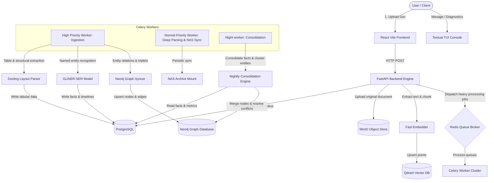
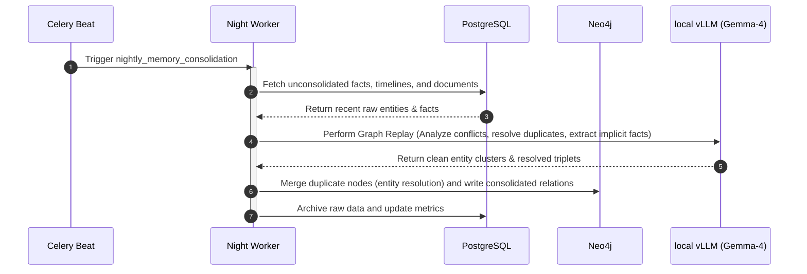

# A-RAG: Autonomous Retrieval Augmented Graph Intelligence Platform

A-RAG is a production-ready, high-performance Autonomous Retrieval Augmented Graph Intelligence Platform. It combines vector databases, knowledge graphs, relational metadata, and LLMs in a multi-stage ingestion and reasoning architecture to deliver extremely accurate, traceable, and contextual grounded chat responses.

---

## 🗺️ System Architecture Overview

The platform uses a decoupled, worker-driven architecture built for high throughput, low latency (< 5-second initial ingestion search-readiness), and resource efficiency.



---

## 🛠️ How It Works (Ingestion & Consolidation Pipelines)

A-RAG operates using a **Two-Tiered Processing Pipeline**:

### 1. Tier-1: Immediate Ingestion Pipeline (< 5-Second Target)
When a document is uploaded, it bypasses heavy models to hit search-readiness as fast as possible:
*   **Storage:** The document bytes are streamed directly to a MinIO S3 bucket under `originals/`.
*   **Classification Routing:** A deterministic rule-based `KnowledgeRouter` inspects the document structure and metadata, assigning routing classifications (e.g. `rfq`, `bom`, `invoice`, `email`).
*   **Fast-Parse:** Text is extracted using fast libraries (`pypdf`, `python-docx`, `python-pptx`, or raw text decoders).
*   **Chunking:** The document is split into parent-child overlapping chunk hierarchies.
*   **Vector Indexing:** Chunks are vectorized using a SentenceTransformer model and upserted into Qdrant. The document is instantly searchable.

### 2. Tier-2: Deep Parsing & Extraction Pipeline (Celery Workers)
In the background, Celery worker processes execute advanced parsing:
*   **Tabular Extraction:** Docling parses complex, nested tables into structural data, storing them in PostgreSQL.
*   **Zero-Shot NER:** GLiNER identifies business entities (Customers, Vendors, Projects, Timelines, Part Numbers).
*   **Fact Triplets:** S-P-O (Subject-Predicate-Object) facts are extracted (e.g., `Customer A` -> `REQUESTED` -> `Part X`).
*   **Graph Synchronization:** Extracted entities and facts are synchronized to Neo4j, forming a semantic web around the document.

### 3. Nightly Consolidation (Memory Replay)
Triggered at midnight via Celery Beat:


---

## 📦 Components Stack

*   **FastAPI Backend:** Orchestrates routing, retrieval, chatbot tracing, and API endpoints on port `8082`.
*   **React + Vite Web UI:** Sleek, Tailwind CSS dashboard for document search, upload progress, and visualization on port `3002`.
*   **Textual TUI:** Diagnostic console showing GPU/CPU stats, database heartbeats, and grounded chatbot logs inside your terminal.
*   **PostgreSQL:** Handles document registries, processing job state, users, tables, and structured timeline events.
*   **Neo4j:** Maps document-to-entity and entity-to-entity graphs.
*   **Qdrant:** Houses high-dimensional parent-child vector chunks.
*   **Redis & Celery:** Drives message broker queues (`high_priority`, `normal_priority`, `night_jobs`).
*   **MinIO:** S3-compatible local bucket storage.
*   **Prometheus & Grafana:** Monitors system health, request latencies, and worker queue backlogs.

---

## 🚀 Installation & Deployment

### Prerequisites
*   Docker & Docker Compose (v2.x+)
*   An active Python 3.11 environment (for running TUI or local scripts)
*   Pre-configured local vLLM server (running at `127.0.0.1:8000` with the `google/gemma-4-31B-it` model)

### 1. Setup Environment
Clone the repository and verify your configuration files:
```bash
git clone https://github.com/dkoustubh/A-RAG.git
cd A-RAG
```

Create a `.env` file from the example:
```bash
cp .env.example .env
```
*(The default configs point to internal Docker Compose database ports. If running python services outside docker, they will connect via 127.0.0.1).*

### 2. Deploy Using Docker Compose
Start the database engines, backend, workers, and frontend:
```bash
chmod +x install.sh
./install.sh
```

This script will download image dependencies, compile layers (reusing cached environments), and boot the containers.

### 3. Running Health Checks
Verify the database connections, container status, and backend endpoints:
```bash
./healthcheck.sh
```

### 4. Running the Textual TUI
To view active GPU/CPU stats and chatbot logs inside your terminal:
```bash
cd tui
python3 -m venv .venv
source .venv/bin/activate
pip install -r requirements.txt
python3 tui.py
```

### 5. Ingestion NAS Sync & Backups
*   **Ingestion Hot-Cache:** Temporary processing writes to `/tmp/arag_hot_cache`.
*   **NAS Archiving:** Persistent copies are backed up to `/mnt/nas/arag_archive`.
*   **Backup & Restore Databases:**
    *   To backup all DB states (Postgres schema, Qdrant snapshots, Neo4j dumps, MinIO buckets):
        ```bash
        ./backup.sh
        ```
    *   To restore to a specific timestamp:
        ```bash
        ./restore.sh <backup_timestamp>
        ```

---

## 📊 Telemetry and Monitoring
*   **Prometheus metrics** are exposed at `http://localhost:8082/metrics`.
*   **Grafana dashboards** are provisioned at `http://localhost:3000` to visualize resource trends and query latencies.
